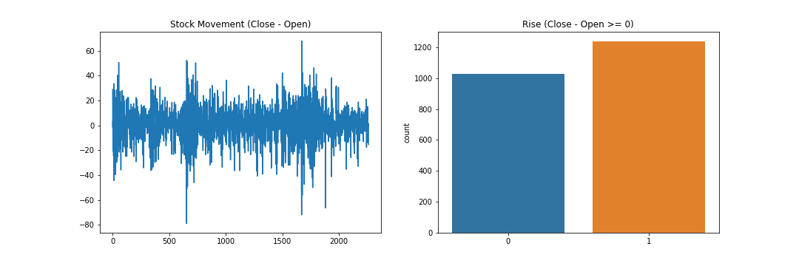
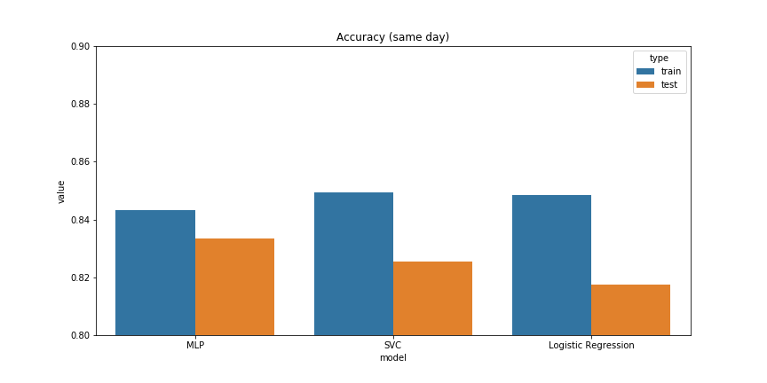
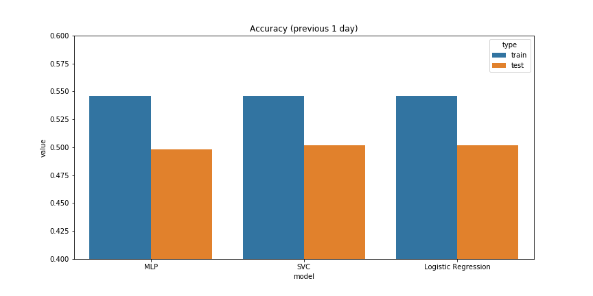
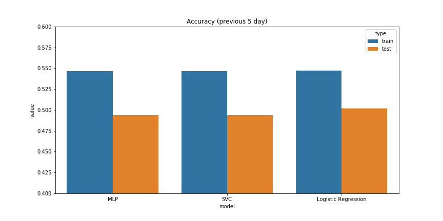

# FDA-hw3 Report

---

1. How did you preprocess this dataset?
> The stock movement is predicted using the difference between prices rather than the original value. This method results in up to around 85% accuracy when predicting the closing price of the same day.
> 
> - input : (OpenPrice - HighPrice), (OpenPrice - LowPrice)
> - output : Rise (ClosePrice - OpenPrice >= 0)
> 

2. Which classifier reaches the highest classification accuracy in this dataset? Why? Can thist result remain if the dataset is different?
> There is no significant difference between models (may be due to inappropriate handling of data).
> 
> 

3. How did you improve your classifiers?
> NA

---

# Guesses
> - More complicated operations are needed while preprocessing the data, such as calculating the general direction of the stock movement.
> - SVM, Logistic Regression, MLP does not perform well when predicting sequential data.
> - Stock movement is too complicated to be predicted with the data used in this practice.

---
